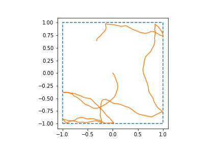

# 2022-02-09

- DONE Add different speeds to trajectory simulations
- DONE Change `RectangleBoundary` to `SquareBoundary`
- DONE Change trajectory from (current direction, current position) to (current direction, next position)
- DONE Write batch optimization routine for spatial RNN 
	- Going to first try to use CG method in scipy.optimize instead of Hessian-free approach used by Cueva and Wei
	- If this doesn't work, I'll try Hessian-free package: https://pythonhosted.org/hessianfree/builtins.html
- Got crude trajectory simulation working
	- Angle is sampled from Brownian motion process
	- Speed is sampled from uniform distribution over [0.0, 0.1, 0.2, 0.3, 0.4]
	- When trajectory collides with boundary, angle is sampled from uniform distribution over [0, 2 * pi] until angle is found that respects boundary
	    - 
