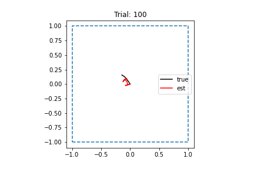

# 2022-03-25

- DONE Re-run RNN with altered speed distribution
	- Changed code (commit: 64d999e)
	- Ran simulation successfully
	- Kicked off RNN training
	- Finished RNN training
		- Loss isn't very low, but trajectories aren't long enough to see whether network has learned path integration better or worse
		- Need to rerun with larger time step
		- 
- DONE Send email to Xiuxin 
	- Sent email; CC'd Braden
