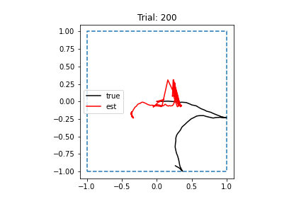

# 2022-03-29

- DONE Run RNN training with altered speed distribution, but longer time step
    - Changed timestep from 0.01 to 0.1 -- this makes the trajectories long enough to hit boundary at least once
	- Ran trajectory simulation
	- Started RNN training
	- Finished RNN training
	- Network not learning path integration task at all -- unclear what's wrong here
    - 
