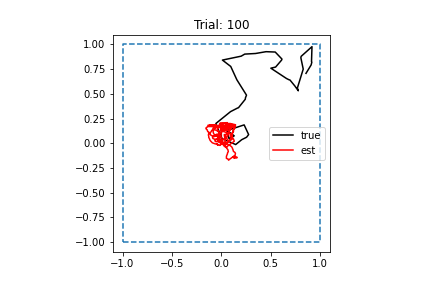

# 2022-04-05

- DONE Figure out how to modify `MotionSimulation` class to generate batches for training
	- Worry about test set later
	- Might need to make `MotionSimulation` a subclass of PyTorch's `Dataset`?
		- Decided not to do this -- doesn't work well unless all trials are stored somewhere
	- Commit: `25d52b1`
- DONE Think about removing `boundary_height` parameter from boundary objects in code 
	- Thought about this, but might table for now because if it's removed, there won't be any clear reason why `SquareBoundary` should even be a class instead of just a single function, and I don't want to do any more refactoring
- DONE Test RNN with new parameters and training routine
	- Started training run on Dirac
	- Run finished. Loss didn't decrease at all; not sure why
	- 
