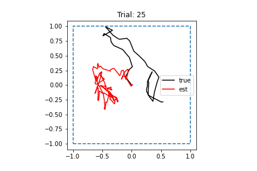

# 2022-04-08

- DONE Try training network with velocity changed to Cartesian coordinates
	- Commit: `7d41fc9`
	- Checked trajectories: Still make sense
	- Kicked off training run on cluster
	- Finished training. Loss decreased, but not by that much
	- Created test dataset in Cartesian coordinates: `data/sim_2022_04_12`
	- Performance did not seem better than test with polar coordinates
	- 
