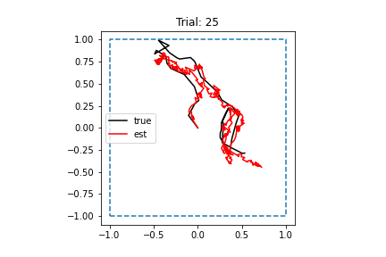
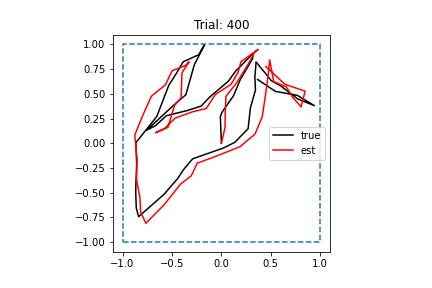
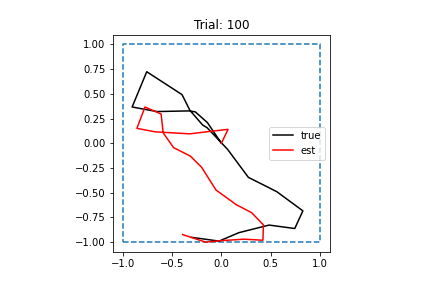
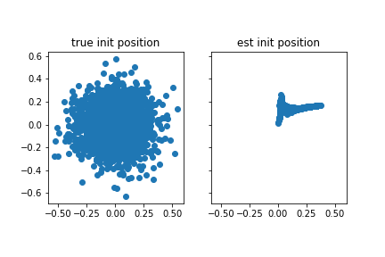

# 2022-04-19

- DONE  Check that simulation data is being generated correctly
	- Wrote notebook (`test_data.ipynb`) that checks that generated trajectories can be integrated
	- Commit: `[main 6f3a369]`
- DONE Change trajectory simulation to use Rayleigh distribution for speed and re-run simulation (Cartesian)
	- Make sure to check Ganguli's code to make sure I'm using roughly the same parameters as he is
	- Commit: `[main b072ea2]`
		- **This commit actually didn't correctly implement sampling!** Use this one instead: `[main 3e8d7d9]`
	- Didn't make significant difference in loss
- DONE Run RNN code with learning rate set to 1e-4 (this is what Ganguli used)
	- NOTE: This code was using the original speed sampling protocol, **not** the Rayleigh distribution
	- Commit: `[main 050fcbd]`
	- Model: `test_2022_04_19_02.pt`
	- Wow! Even after 5 epochs, effect on loss is amazing!
	- Training loss decreased almost to zero!
	- Next step: Run on polar coordinates, make trajectories more smooth
	- 
- DONE Run RNN with gradient clipping
	- Maybe putting this back will help?
	- This appeared to help slightly when I tried it on my local machine
	- Want to look more into this later
- DONE Run RNN with new learning rate on polar input with sampling from Rayleigh distribution
	- Commit: `[main 3e8d7d9]`
	- If this doesn't work, I should revert to the old model of speed sampling and make sure lowering learning rate improves performance on polar trajectories too. After that works, I can then figure out how to tune the Rayleigh speed sampling to make that work.
	- Loss decreased significantly, and network learns path integration pretty well!
		- 
	- However, network can sometimes get integration wrong at beginning of path:
		- Could this be because of hidden state initialization?
		- 
	- Found bias in initial position!
		- Why is this happening?
		- Maybe answer is to start all sequences with zero velocity, zero position entry?
		- 
