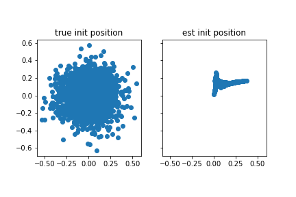

# 2022-04-20

- DONE Figure out why network messes up initial position
	- The problem: Average error is extremely large for the first couple of trajectory points
		- 
	- By looking at the error between the increments at each time point, we can see that **the first time point is the major problem**:
		- 
	- This is due to a significant bias in the first time point:
		- 
	- Possible answer: Initializing hidden unit activities to zero causes problem
		- Maybe adding a zero-velocity entry at the beginning of each trajectory would help this?
	- Another idea: Lack of bias terms causes problem
		- Checked Cueva and Wei, 2018: in model, recurrent units have biases
		- Maybe adding these back in will help?
	- Another idea: Polar coordinates cause problem
		- Evidence: This doesn't occur with Cartesian velocity inputs
- DONE Run RNN with bias term added to hidden layer
	- To match Cueva and Wei paper, bias needs to be initialized to zero
	- PyTorch RNN only has option for adding bias to input and recurrent weights, so I have to add both
	- Commit: `[main e3e3de6]`
	- Launched on cluster
	- Model slightly improved, but not by that much
		- 
    - Avg. error
		- 
    - Incremental error
		- 
    - Init position
		- 
- DONE See if errors on first timestep are a problem with Cartesian coordinates
	- Commit: `[main da2ff09]`
	- Launched on cluster
	- Errors on first timestep are **not** a problem with Cartesian coordinates
	- Overall performance is better:
		- 
	- No noticeable bias in initial position:
		- 
	- Initial avg. error and incremental error are much smaller:
		- 
    - Incremental error
		- 
