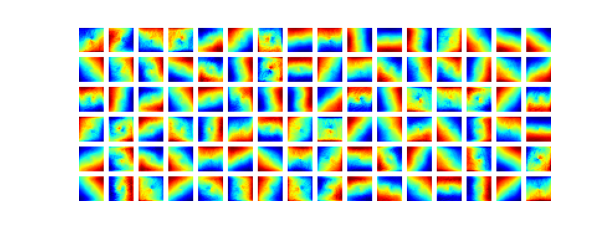
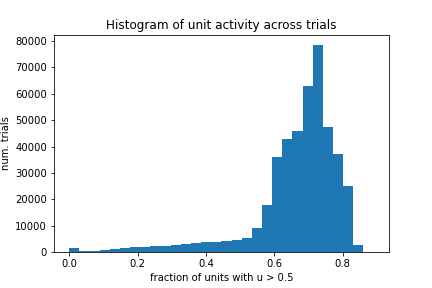
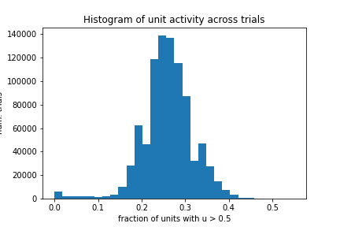
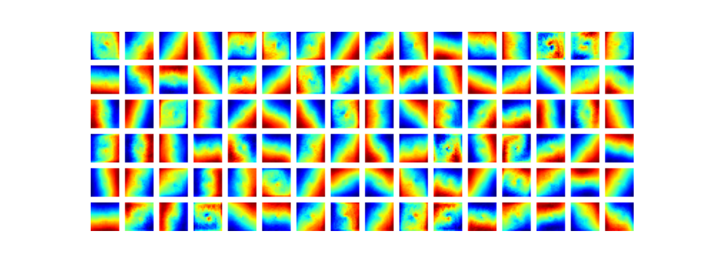

# 2022-04-26

- Meeting with Braden
	- Idea: Try training the network for longer, see if grid cells emerge
	- Question: Why are Ganguli et al using cross-entropy loss?
		- Idea: Cross-entropy loss might perform the same function as the metabolic penalty from Cueva and Wei does
	- Roadmap:
        1. Run current code for more batches; see if error goes down further and grid cells emerge
	    2. Clean up grid cell plotting code adapted from Ganguli 
	    3. Add metabolic penalty to loss function
	    4. Try to get both Ganguli and Cueva and Wei code to run
- DONE Run RNN training for 3000 batches
	- Commit: `[param-refactor 88d598e]`
	- Started run on cluster
	- Finished! Downloaded model: `test_2022_04_26.pt`
	- Loss was still decreasing at batch 3000; going to try to run for 5000 batches
	- Final loss: 0.0106
	- Ratemaps have clearly different structure:
		- 
- DONE Add metabolic penalty to RNN loss function
	- Going to need to replace off-the shelf loss with function written from scratch
	- Loss function from Cueva and Wei
		- Component 1: Mean squared error, with average taken over number of points (num. trials * num. points per trial * 2)
		- Component 2: L2 regularization on input and output weights (not recurrent weights!)
		- Component 3: Metabolic cost, computed as mean squared activation across time and num. batches
	- It seems that they're also doing contracting autoencoder (CAE) regularization on the recurrent weights in the code
		- Not mentioned in the paper!
		- Need to figure out what this means, and if it's necessary
	- Regularization parameters
		- Weights (L2): 0.5 (`rnn.m`, line 145)
		- Metabolic (h): 0.1 (`rnn.m`, line 152)
- Sparseness of hidden unit activity in RNN
	- Looked at activity of hidden units in trained RNN
	- Question: Are these representations sparse? Are only a few hidden units active at any one time, or are they all active at once?
	- Plotted histogram of fraction of hidden units whose activity (absolute value of output) exceeded 0.5 for model trained on 1900 batches (`models/test_2022_04_26.pt`)
		- This indicates that most hidden units are active most of the time; **hidden representation is not sparse**
		- 
	- Also plotted same histogram for model trained on 3000 batches (`models/test_2022_04_26_02.pt`)
		- Unit activities for this model are **more sparse than model trained on fewer batches**
		- 
- DONE Run RNN training for 5000 batches
	- Commit: `[param-refactor 9b7a2d6]`
	- Launched on cluster
	- Finished. Final loss: 0.0051
	- Loss still decreasing! Going to try to run for 8000 batches next
	- Hidden units have similar tuning as 3000-batch run:
		- 
- DONE Add parameter saving to `train_model.py`
	- Need to implement `save_model()` and `load_model()` functions in `model.py`
	- Commit: `[param-refactor 0d956ca]`
- DONE Simplify `compute_ratemaps()` function to only use one batch
