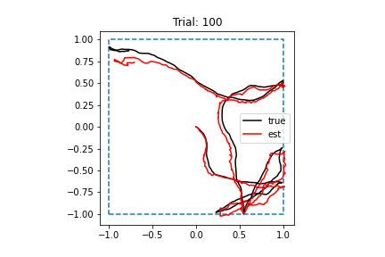

# 2022-04-27

- DONE Run RNN for 8000 batches
	- Commit: `[param-refactor 0d956ca]`
	- Launched on cluster
	- Loss seemed to stop decreasing! Final loss: 0.0028
	- Performance:
		- 
	- Tuning:
		- 
    - Activity:
		- 
- DONE Update old parts of codebase
	- To update:
		- `examine_rnn_model.ipynb`
		- `motion_simulation.ipynb`
		- `sample_trajectories.ipynb`
		- `test_data.ipynb`
		- `test_motion.ipynb`
	- Renamed a bunch of notebooks
	- Updated initial position bias notebook
	- Updated trajectory generator notebook
	- Commit: `[param-refactor 91c92aa]`
- DONE Merge `param-refactor` back into `main`
