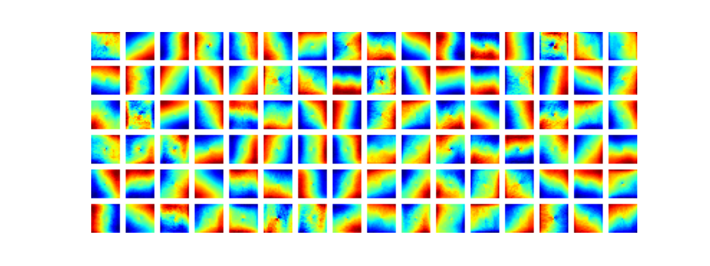
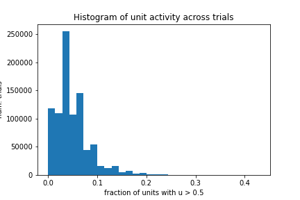

# 2022-04-30

- DONE Run RNN training with new loss function
	- Commit: `[main 6671917]`
	- Launched on cluster!
	- Successfully ran. Loss was still decreasing after 5000 batches
	- Performance same as model with old loss function
	- Tuning is very similar to model with old loss function:
		- No grid-like tuning structure
		- 
	- Activity histogram shows (as expected) shift to the left:
		- 
