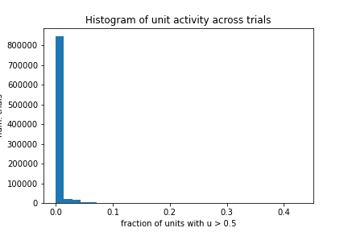
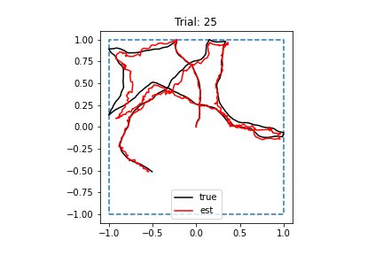
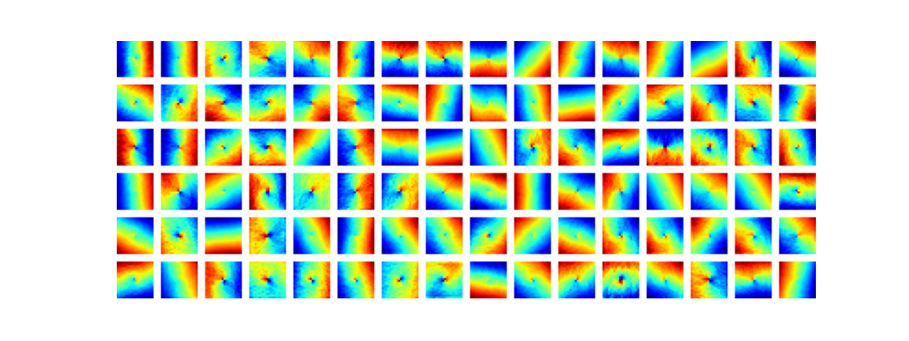
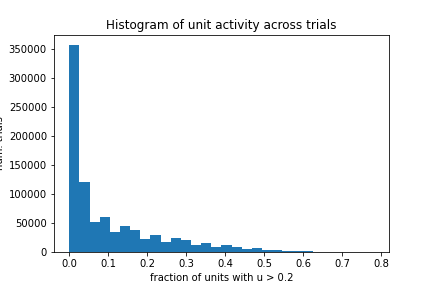

# 2022-05-04

- DONE Run training with new loss function for 8000 batches
	- Launched on cluster
	- Finished. Loss seemed to converge
	- Tuning and performance are unaffected
- DONE Train RNN with $\lambda_h = 0.5$
	- Launched on cluster
	- Finished. Loss might have still been decreasing.
	- Performance and cell tuning unaffected
	- Cell activity histogram is more decreased
		- 
	- Need to increase $\lambda_h$ more to see if this is the cause
	- Because performance isn't degraded, $\lambda_h$ can be increased further
- DONE Train RNN with $\lambda_h = 1.0$ 
	- Launched on cluster
	- Finished running. Loss definitely converged.
	- Model stored at `models/20220510_01`
	- Performance seems normal
		- 
	- Tuning is same as before
		- 
	- Activity is sparse
		- 
	- Conclusion: Need to increase $\lambda_h$ even more!
- DONE Add functionality to `Trainer` class that computes MSE for each run
- DONE Save MSE curve for each run in `runinfo.json` file 
