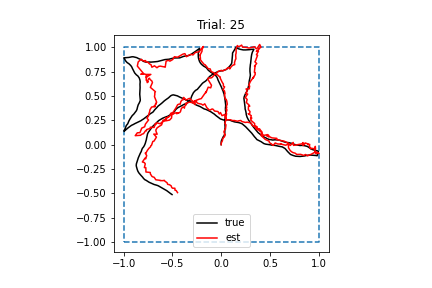
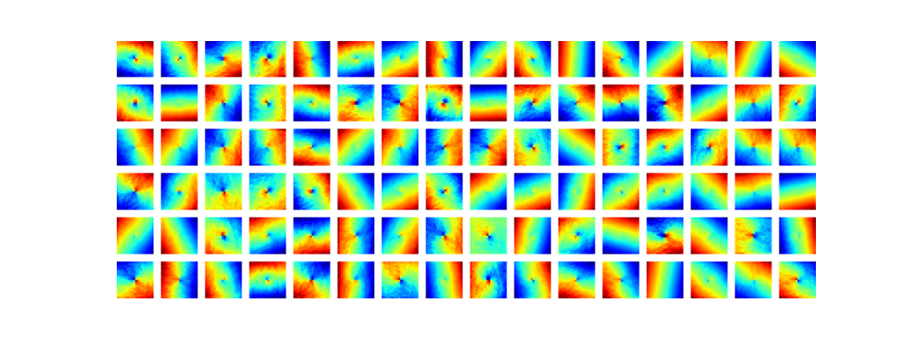
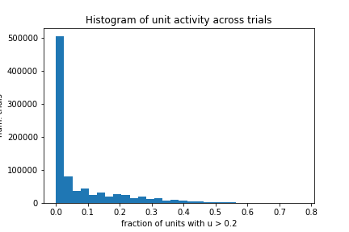

# 2022-05-12

- DONE Train RNN with $\lambda_h = 2.0$
	- Run finished. Loss clearly converged.
	- Performance is normal
		- 
	- Tuning is the same
		- 
	- Activity is even more sparse
		- 
	- Need to run with even greater metabolic penalty
- TODO Add CUDA acceleration to RNN training code 
- TODO Add MSE trace to `Trainer` class 
- DONE Add network checkpoints to `Trainer` class 
- TODO Sanity check: Make sure I'm not using fewer data points than Ganguli code 
- TODO Sanity check: Test performance on single trajectory rotated 90 degrees four times 
	- This is to make sure theta is symmetrical
- TODO Add different boundary collision handling to code 
	- Direction angle continues Brownian motion process uninterrupted
	- If current speed and direction will take agent outside of boundary, speed is set to zero
- TODO Compute RNN performance as function of trajectory timestep and see if this correlates with boundary collisions (or smoothed version of them) 
