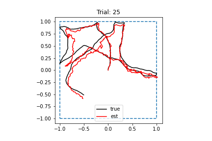
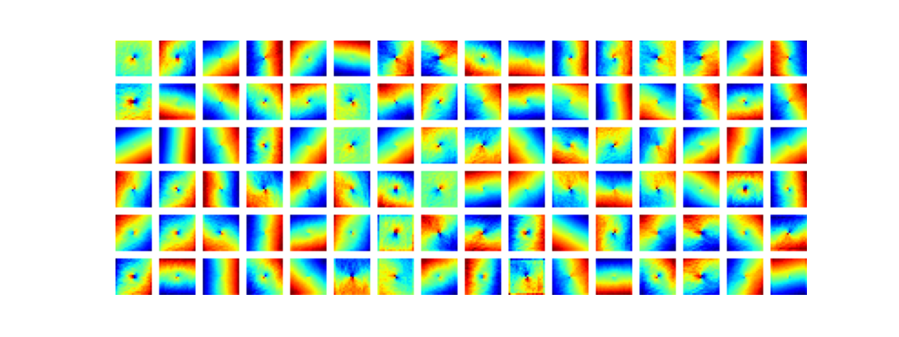
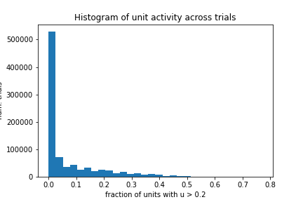

# 2022-05-14

- DONE Run RNN with $\lambda_h=4.0$ 
	- Run finished. Loss seemed to converge.
	- Performance is normal:
		- 
	- Tuning is the same as before, with more pronounced center in fields:
		- 
	- Activity
		- 
	- Need to increase $\lambda_h$ more!
